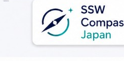

[](https://github.com/sugukurukabe/ssw-compass/actions/workflows/ci.yml)
[](https://github.com/sugukurukabe/ssw-compass/actions/workflows/cd-staging.yml)
[](LICENSE)

# SSW Compass (SSW)

> *The compass for Japanese visa procedures.*
> 「日本ビザ手続きの羅針盤。」
> *Kompas untuk prosedur visa Jepang.*

## What is SSW?

SSW Compass is a public, read-only, anonymous MCP App that grounds
Japanese Specified Skilled Worker (特定技能 / SSW) and related visa questions
in 出入国在留管理庁 official documents. SSW points the way — it does **not**
perform legal representation (行政書士法 §19-1). Every response is accompanied
by a standard disclaimer directing users to a certified gyoseishoshi or
attorney for individual cases, and the pipeline blocks personal identifiers
(residence card numbers, passport numbers, My Number) before any retrieval.

## Status

**Sprint 4 complete.** Production deployed and live at **https://mcp.ssw-compass.jp**:

- **7 tools** (search, classify, deadline, docs, law_updates, approval, zairyu)
- **10 languages** (ja/en/id full Vertex grounding; 7 others disclaimer-only)
- **Freemium tiers**: Free (anonymous) / Pro (JWT) / Business (Sprint 5+)
- **HITL 12 controls** (H01 L2 lockgate, H04 7-year audit log, H06 illegal-work alert, H07 PII guard)
- **CSP enforcing** (Trusted Types + hash-based)
- **Global HTTPS LB** + **Cloud Armor WAF** (`ssw-waf-policy-prod`)
- **GCS audit bucket** (`gs://ssw-compass-audit-7y`, 7-year WORM)

**Sprint 5 Phase A (next)**: Logo, screenshots, demo video × 3 lang,
privacy policy (gyoseishoshi review), license decision, Connectors Directory submission.

**Sprint 5 Phase B**: Vertex AI Search real flip, 6-host verification, Cloudflare migration.

For staging URL discovery (developer access only):

```bash
gcloud run services describe ssw-mcp-staging \
  --region=asia-northeast1 --format='value(status.url)'
```

See [docs/sprints/sprint-4-summary.md](docs/sprints/sprint-4-summary.md) for the full
Sprint 4 retrospective.

## Quick start (local development)

Prerequisites (macOS): Node 22, pnpm 10,
[`cloudflared`](https://developers.cloudflare.com/cloudflare-one/connections/connect-networks/get-started/),
and Claude Desktop. Docker is **not** required for local iteration; the
Cloud Run build uses a distroless image produced in CI (see
[apps/server/Dockerfile](apps/server/Dockerfile)).
Working on infrastructure also requires
[`direnv`](https://direnv.net/) and `gcloud` — see
[docs/onboarding.md](docs/onboarding.md) for the one-time setup.

```bash
# 1. Clone & install
git clone https://github.com/sugukurukabe/ssw-compass.git
cd ssw-compass && pnpm install

# 2. Build shared workspaces (UI depends on @ssw/shared-types + @ssw/ui-bridge)
pnpm -F @ssw/shared-types build
pnpm -F @ssw/ui-bridge build

# 3. Build the 4 UI bundles (single-file HTML, ~300 KB each)
pnpm -F @ssw/ui-ssw-search build
pnpm -F @ssw/ui-ssw-classify build
pnpm -F @ssw/ui-ssw-timeline build
pnpm -F @ssw/ui-ssw-checklist build

# 4. Start the MCP server on http://localhost:8080
pnpm -F @ssw/server dev

# 5. In another terminal, expose the server via a Cloudflare quick tunnel
cloudflared tunnel --url http://localhost:8080
#    → copy the printed https://*.trycloudflare.com URL for the next step
```

For staging Cloud Run access (no local server required), see
[docs/deploy-runbook.md](docs/deploy-runbook.md) and use an ID token
minted with `gcloud auth print-identity-token` against the service URL
returned by the command in the Status section above.

### Claude Desktop connection

1. Copy `.claude/desktop_config.example.json` to
   `~/Library/Application Support/Claude/claude_desktop_config.json`
   (merge the `mcpServers` entry if that file already exists).
2. Replace `YOUR_TUNNEL_URL` with the Cloudflare tunnel URL from step 5.
3. Quit Claude Desktop completely (Cmd+Q) and relaunch it.

> ⚠️ `.claude/desktop_config.json` (the real file, not the `.example`) is
> listed in `.gitignore`. Do **not** commit files containing live tunnel URLs
> or any credentials to this repository.

### Cloudflared tunnel modes

| Mode | When to use | Command |
|---|---|---|
| Quick tunnel (local default) | Ephemeral URL, no account setup | `cloudflared tunnel --url http://localhost:8080` |
| Named tunnel | Stable URL, requires login + DNS | `cloudflared tunnel login`<br>`cloudflared tunnel create ssw-dev`<br>`cloudflared tunnel route dns ssw-dev ssw-dev.<your-domain>`<br>`cloudflared tunnel run --url http://localhost:8080 ssw-dev` |

## Architecture

```
apps/server           MCP server (Express + StreamableHTTPServerTransport)
ui/ssw-search         UI Resource (Vite + single-file HTML, no React)
packages/shared-types zod schemas + DISCLAIMER_BY_LANG (ja/en/id)
packages/ui-bridge    null-safe DOM helpers shared across UIs
packages/tsconfig     Shared TypeScript compiler configs
```

For the full design see [`docs/specs/SPEC-INDEX.md`](docs/specs/SPEC-INDEX.md)
(reading order and conflict resolution between v2 and v3).

## Troubleshooting

## Privacy Policy

SSW Compass does not collect personal information. Inputs containing residence card numbers,
passport numbers, My Number, names, full dates of birth, or home addresses are blocked before
tool processing. Operational security logs are used only for service reliability and abuse
prevention.

Full policy: [https://mcp.ssw-compass.jp/privacy](https://mcp.ssw-compass.jp/privacy)

## Usage Examples

Try these prompts in Claude Desktop / Claude Web after connecting the MCP server:

- `特定技能1号 建設分野の在留期間更新手続を教えて`
- `直近の法改正情報を教えて。入管法と行政書士法を中心に`
- `特定技能1号 農業分野の必要書類チェックリストを見せて`

Support contact: `a_kabe@sugu-kuru.co.jp`

**SSW does not appear in Claude Desktop.**
Check that `~/Library/Application Support/Claude/claude_desktop_config.json`
exists and contains a valid `mcpServers.ssw-local` entry. A single JSON syntax
error will silently disable every MCP server in that config — validate with
`jq . ~/Library/Application\ Support/Claude/claude_desktop_config.json`.
After edits, **fully quit and relaunch** Claude Desktop (Cmd+Q, not just close
the window). To smoke-test the bridge in isolation, run
`npx -y mcp-remote YOUR_TUNNEL_URL/mcp` in a terminal and confirm stdio output.

**The Cloudflare tunnel URL changes every time I restart.**
This is by design for quick tunnels (`cloudflared tunnel --url ...`) — each
run provisions a fresh `*.trycloudflare.com` hostname. Update
`.claude/desktop_config.example.json` (or the real config you copied to the
Claude support directory) with the new URL and restart Claude Desktop. If you
need a stable URL, switch to a named tunnel (see the table above).

## License

[Apache-2.0](LICENSE). See `LICENSE` and `NOTICE`.

## Disclaimer

This service provides general information only and does not constitute
legal advice or gyoseishoshi services under Japanese law. For individual
cases, consult a certified gyoseishoshi or attorney.

本サービスは一般的な情報提供のみを目的とし、法律相談・行政書士業務には
該当しません。個別の手続きについては行政書士又は弁護士にご相談ください。

Layanan ini hanya menyediakan informasi umum dan bukan merupakan nasihat
hukum. Untuk kasus individu, silakan berkonsultasi dengan gyoseishoshi
atau pengacara.

## Design Specs

- [Reading order & conflict resolution](docs/specs/SPEC-INDEX.md)
- [v3 supplement (supersedes v2 where conflicts exist)](docs/specs/v3-supplement.md)
- [v2 comprehensive design](docs/specs/v2-comprehensive-design.md)
