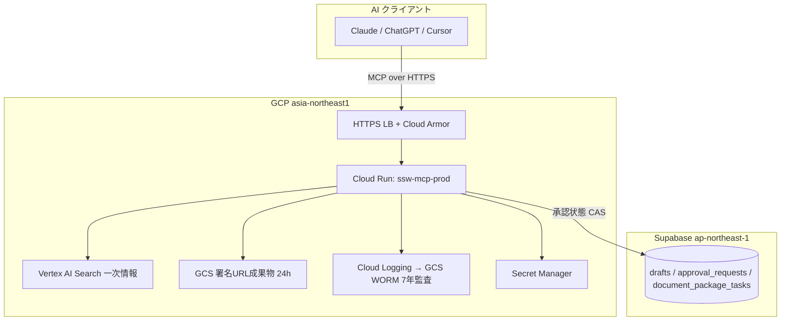

# SSW Compass 包括説明資料 / Comprehensive Overview / Ikhtisar Menyeluruh

- 対象バージョン: v2.1.0（MCP 2026-07-28 RC 対応）+ v2.2（`get_package_status` 追加）
- 最終更新: 2026-06-13
- 本番 URL: https://mcp.ssw-compass.jp

> 本書は、ここまでの開発で SSW Compass がどう進化し、いま何ができるのかを
> 非エンジニアにも分かるようにまとめた説明資料です。

---

## 1. SSW Compass とは / What it is / Apa itu

SSW Compass は、日本の**特定技能（SSW / 特定技能）ビザ手続き**に関する情報を、
出入国在留管理庁などの**公式一次情報に基づいて**提供する、公開・読み取り中心の
**MCP アプリ**です。Claude / ChatGPT などの AI アシスタントから「ツール」として
呼び出して使います。

**3つの根本原則（不変）**

1. **個人情報を扱わない** — 氏名・在留番号・パスポート番号・マイナンバー・
   完全な生年月日は受け付けない（年月のみ）。
2. **法律行為はしない** — 情報提供のみ。全回答に免責事項を必ず付与。
3. **一次情報のみ** — Vertex AI Search の結果を「公式ソースかつ信頼度 ≥ 0.7」で
   フィルタ。AI の推測（知識ベース）にはフォールバックしない。

---

## 2. この開発で何が進化したか / What changed / Apa yang berubah

今回の開発で、SSW Compass は「6つの匿名読み取りツール」から
**「9ツール（6読み取り + 3 Pro書き込み/状態照会）」** へ拡張され、
MCP の次期仕様（2026-07-28 RC）に**先行対応**しました。

| 観点 | 開発前 (v4.0.0) | 開発後 (v2.1/v2.2) |
| --- | --- | --- |
| ツール数 | 7（うち書き込み1） | **9**（読み取り6 + Pro 3） |
| MCP プロトコル | 2025-11-25 | **2025-11-25 + 2026-07-28 RC** 併存 |
| 認証モデル | JWT tier のみ | **OAuth scope step-up**（4スコープ） |
| 書類パッケージ生成 | なし | **`prepare_document_package`**（GCS 署名 URL） |
| 承認フロー | 単発記録 | **多段承認 MRTR**（状態機械 + CAS + 監査） |
| 永続ストア | Cloud Logging のみ | **+ Supabase（運用状態）+ GCS（成果物）** |
| 出力スキーマ | draft-07 | 全ツール **`outputSchema` + アイコン** |
| 言語 | ツールにより 3〜10 | **入力 10 言語に統一** + 10言語エラー辞書 |
| 可観測性 | span 未送出 | **OTel トレース伝搬**（traceparent 等） |

---

## 3. 何ができるか — 9つのツール / The 9 tools / 9 alat

### 3.1 匿名で使える読み取りツール（6種・無料）

誰でも認証なしで使える、情報提供ツールです。

| ツール | できること |
| --- | --- |
| `search_visa` | 特定技能・関連ビザ手続きを公式情報源から検索 |
| `classify_procedure` | 現在の在留資格・希望資格・所在地から「必要な申請種別」を判定（確信度・前提付き） |
| `get_deadline_timeline` | 法定期限のタイムライン（14日以内届出・定期届出4/1〜5/31・更新は期限3ヶ月前から・通算5年上限など） |
| `list_visa_documents` | 申請区分・分野ごとの必要書類リスト（省略条件適用） |
| `list_law_updates` | 入管法改正・手数料改定・様式改正などの制度変動フィード（データ最終確認日付き） |
| `validate_zairyu_compatibility` | 在留資格と想定就労の適合性判定（不法就労アラート H06） |

これらには対応する **MCP App UI（5種）** があり、検索結果・ガント・チェックリスト・
ウィザード等を視覚的に表示します（10言語の母語エラー表示・再試行ボタン付き）。

### 3.2 Pro tier（行政書士認証）専用ツール（3種）

改正行政書士法§19 に基づき、**Pro かつ行政書士認証済み**ユーザーのみ利用可能（L2）。
匿名・無料ユーザーは scope ゲートで HTTP 403 + HITL ゲートで拒否されます。

| ツール | できること | スコープ |
| --- | --- | --- |
| `prepare_document_package` | 案件の書類パッケージを生成し、GCS の**24時間有効な署名付き URL**を発行（冪等・同一鍵で再現） | `compass:draft` |
| `submit_gyoseishoshi_approval` | 行政書士による書類承認を記録（多段 MRTR 対応・監査ログ7年保存） | `compass:approve` |
| `get_package_status` | 発行済みパッケージの状態を `idempotency_key` で照会し、完了済みなら**新しい署名 URL を再発行**（呼び出し元 principal にスコープ） | `compass:draft` |

---

## 4. 技術的な進化 / Technical evolution / Evolusi teknis

### 4.1 MCP 2026-07-28 RC 先行対応

次期 MCP 仕様（公開予定日 2026-07-28）に Day-1 対応するため、以下を実装:

- **`server/discover`** — 起動時ディスカバリ RPC
- **`Mcp-Method` / `Mcp-Name` ルーティングヘッダ検証**（不一致は 400）
- **ステートレス Streamable HTTP**（Cloud Run マルチインスタンスで安定）
- **Multi Round-Trip（MRTR）承認** — `requestState` 不透明トークン（`ars_` + 128bit）、
  TOCTOU 検知・リプレイ防止・編集ループ3周で自動エスカレーション

> これらは公式 SDK が未対応のため薄い Express アダプタとして実装。撤去条件は
> ADR-025 に明記（安定版 SDK 対応・仕様確定を待つ）。

### 4.2 承認状態機械 + アトミック CAS

- 状態遷移は**純粋関数**で評価（`pending → approved → executed | rejected | expired | escalated`）
- DB 更新は**アトミック Compare-And-Swap**（リプレイ・二重承認を 0 行で検知）
- 呼び出し元 principal の検証（他人のトークンで他人の承認を操作できない）

### 4.3 セキュリティ / OAuth scope step-up

4段階スコープ（`compass:read` / `:draft` / `:approve` / `:execute`）で、
ツールごとに必要権限を強制。不足時は **HTTP 403 + `WWW-Authenticate`** を返却。
既存の JWT tier（free/pro/business + gyoseishoshi_verified）と互換マッピング。

### 4.4 10言語対応

`ja / en / id / zh-CN / zh-TW / vi / tl / th / km / my` の 10 言語。
- 入力言語を全ツールで統一
- 凍結キー（`error.<kind>`）の **10言語エラー辞書**を UI にインライン封入
- Vertex grounding は ja/en/id が本格品質、他7言語は段階的改善中

---

## 5. アーキテクチャ / Architecture / Arsitektur

**役割分担（重要）**

- **監査の正本**: Cloud Logging → GCS WORM（7年保持、ADR-015）。不変。
- **運用状態**: Supabase（承認フロー・パッケージ状態、ADR-024）。**PII 非保存**。
- **成果物本体**: GCS（24時間で自動削除、署名 URL で都度配布）。

---

## 6. インフラ構築の実績 / Infrastructure / Infrastruktur

今回の開発で本番に新規構築したもの:

| リソース | 内容 |
| --- | --- |
| Supabase 専用プロジェクト | `ssw-compass`（ap-northeast-1 / Tokyo）、migration 001–005 適用、RLS deny-by-default + service_role 限定 |
| Secret Manager | `ssw-supabase-url` / `ssw-supabase-service-role-key`（asia-northeast1 user-managed）、runtime SA に accessor 付与 |
| GCS バケット | `ssw-compass-packages-prod`（private、uniform ACL、**24h ライフサイクル**、V4 署名用 IAM） |
| Cloud Run env | Terraform で上記シークレット + `PACKAGE_ARTIFACT_BUCKET` を注入 |

---

## 7. 品質・準拠の保証 / Quality & compliance / Kualitas & kepatuhan

- **テスト**: 44 ファイル / 303 ユニットテスト PASS
- **本番 E2E 検証済み**:
  - `prepare_document_package` → GCS 署名 URL 実ダウンロード・冪等性・競合検知
  - `submit_gyoseishoshi_approval` → 承認記録 + 監査ログ
  - `get_package_status` → 生成前後の状態遷移・テナント分離・署名 URL 再発行
  - 匿名アクセス → scope ゲート 403（`-32003`）
- **CI/CD**: lint + typecheck + test、Terraform validate、Bugbot、staging/prod スモーク
- **公式準拠**: 入管法§19（行政書士業務）/ PII 非取扱い / 全レスポンス免責 /
  一次情報 ≥ 0.7 / CSP（`unsafe-eval` 不使用、本番 dist は sha256 + Trusted Types）

---

## 8. 設計判断の記録（ADR）/ Decision records / Catatan keputusan

- **ADR-024**: 承認状態を Supabase に置く（監査ログとは分離、PII 非保存）
- **ADR-025**: RC アダプタは安定版 SDK 対応まで維持（撤去トリガーを明記）
- read-only ルール（`.cursor/rules`）を L2 HITL 例外に整合（ADR-024 準拠）

---

## 9. 今後 / What's next / Selanjutnya

- 外部 SDK（`@modelcontextprotocol/sdk`）が `server/discover`・ルーティングヘッダ・
  Tasks/elicitation を**安定版**で提供したら、Express アダプタを撤去（ADR-025 トリガー）
- MCP 2026-07-28 仕様の正式公開後に RC 挙動を確定
- 10言語の Vertex grounding 品質を ja/en/id 以外へ段階拡張
- Cloud Tasks による `prepare_document_package` の非同期化（opt-in 実装済み・本番は同期運用）

---

## 付録: 用語 / Glossary / Glosarium

| 用語 | 意味 |
| --- | --- |
| MCP | Model Context Protocol。AI が外部ツールを呼ぶ標準プロトコル |
| MRTR | Multi Round-Trip Request。複数往復する対話型ツール呼び出し（承認フロー等） |
| HITL | Human-In-The-Loop。人間の承認を挟む制御 |
| CAS | Compare-And-Swap。競合・二重実行を防ぐアトミック更新 |
| 署名付き URL | 一定時間だけ有効な GCS ダウンロード URL（認証情報を埋め込まない） |
| 一次情報 | 出入国在留管理庁等の公式発出資料 |
