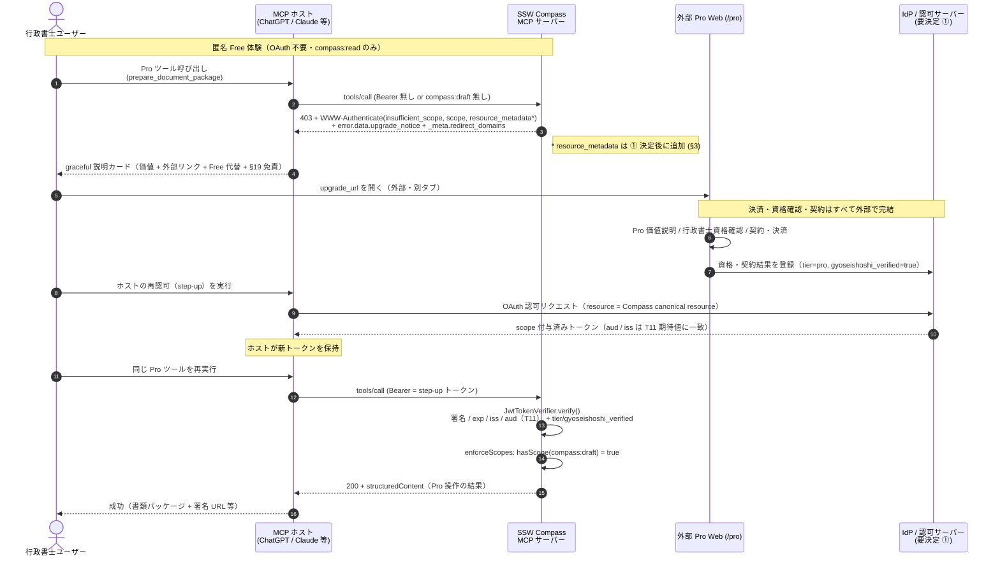

# Phase 2b 設計仕様: 外部 Pro ランディング + step-up 認可導線

# Phase 2b spec: external Pro landing + step-up authorization path

# Spesifikasi Fase 2b: landing Pro eksternal + alur otorisasi step-up

> **種別**: 設計仕様のみ（SPEC ONLY）。本書はコードを変更しない。
> This is a design specification only; no implementation is included here.
> Ini hanya spesifikasi desain; tidak ada implementasi di sini.
>
> **実装しない理由**: (a) 外部 Web インフラ（`/pro` ランディング・決済・資格確認）が未構築、
> (b) **① OAuth 公開可否の決定が未確定**（§3）。①の確定前に着手できない箇所を §3 / §4 に列挙する。
>
> ステータス: Draft / 提案 — レビュー待ち
> 対象コミット: `main` HEAD `cc982e8`（Phase 2a マージ済み）時点の実装。
> 関連: `docs/ux/free-to-pro-experience.md` §6 Phase 2b / §7 / §8、
> `docs/well-known-reconciliation-proposal.md`（T8-B, 論点 A = RFC 9728）、
> `docs/ssw-compass-master-plan.md` T11（Pro/JWT 認可）/ T12（外部チェックアウト誘導）、
> ADR-013（auth strategy）、ADR-024（L2 HITL 書き込みツール）。

---

## 0. 要旨 / Abstract / Abstrak

Phase 2a（Graceful upgrade explanation、`apps/server/src/auth/upgrade-notice.ts`、PR #117 マージ済み）で、
Free ユーザーが Pro ツールに未認可で触れた時に **「価値説明 + 外部リンク + Free 代替導線 + §19 免責」** を
返す土台ができた。Phase 2b は、その外部リンク先である **外部 Pro ランディング（`/pro`）の契約**と、
**step-up 再認可フロー**（403 チャレンジ → 外部で資格確認 + 契約 + scope 付与 → ホスト OAuth 再認可 → 同じ Pro 操作を再開）
を設計する。

**責務分界の核心**: 決済・本人確認（行政書士資格確認）・契約は **完全に MCP サーバーの外**（外部 Web）で完結し、
**MCP サーバーは付与済みの scope を検証するだけ**（`enforceScopes`）。アプリ内課金はしない。
匿名 Free 体験は一切壊さない（OAuth は Pro ツールに触れた時だけ要求する step-up）。

> Phase 2a returns a calm structured explanation when a Free user hits a Pro tool. Phase 2b
> specifies the external `/pro` landing contract and the step-up re-authorization flow. Payment,
> identity (gyoseishoshi) verification, and contracting happen entirely **outside** the MCP server;
> the server only **verifies** the granted scope. No in-app billing. Anonymous Free is never broken.

---

## 1. 外部 Pro ランディング (`/pro`) の契約 / External Pro landing contract

### 1.1 `/pro` が行う場（責務）

外部 Web（例: `https://compass.sugukuru.example/pro`。実ドメインは **要決定**、§5）は、
以下を **MCP サーバーの外**で完結させる場である。

| # | 行うこと | 補足 |
| --- | --- | --- |
| A | **Pro 価値説明** | Phase 2a の `what_you_can_do` と整合。行政書士向けに限定（本人/家族には勧めない、§6 非目標）。 |
| B | **行政書士資格確認** | `gyoseishoshi_verified` の根拠付け。確認手段（士業会員照合・書類審査等）は外部の責務。**要決定**（§5）。 |
| C | **契約 / 決済** | 価格・サブスク・支払いは外部チェックアウトで完結（T12）。MCP には決済 UI を一切出さない。 |
| D | **scope 付与** | 契約 + 資格確認の結果を、IdP / 認可サーバーが JWT クレーム（`tier` / `gyoseishoshi_verified`）として発行。 |

付与される scope は MCP 側の導出規則（`apps/server/src/auth/scopes.ts` `scopesForAuthContext`）に従う:

```23:35:apps/server/src/auth/scopes.ts
export function scopesForAuthContext(ctx: AuthContextType): Set<CompassScope> {
  const scopes = new Set<CompassScope>(["compass:read"]);
  if (ctx.tier === "pro" || ctx.tier === "business") {
    scopes.add("compass:draft");
  }
  if ((ctx.tier === "pro" || ctx.tier === "business") && ctx.gyoseishoshi_verified) {
    scopes.add("compass:approve");
  }
  if (ctx.tier === "business") {
    scopes.add("compass:execute");
  }
  return scopes;
}
```

→ 外部は **トークンのクレーム（`tier`, `gyoseishoshi_verified`）を正しく立てる**ことに責任を持つ。
scope そのものは MCP がクレームから導出する（外部が `compass:*` 文字列を直接埋め込む必要はないが、
IdP 実装によっては scope を直接発行する設計もあり得る。**どちらを正とするかは ① / IdP 決定に依存**、§3）。

### 1.2 MCP サーバーとの責務分界（境界）

| 領域 | 外部 Web (`/pro`) | MCP サーバー |
| --- | --- | --- |
| 価格・決済 | **担う**（外部チェックアウト） | 一切持たない（アプリ内課金禁止、T12） |
| 本人確認（行政書士資格） | **担う**（資格審査・記録） | 持たない。トークンの `gyoseishoshi_verified` を**信頼して検証するのみ** |
| 契約・サブスク管理 | **担う** | 持たない（非目標、§6） |
| トークン / scope 発行 | **担う**（IdP / 認可サーバー） | 発行しない |
| scope の**検証**と機能ゲート | 持たない | **担う**（`enforceScopes` / `JwtTokenVerifier`） |
| PII | **MCP に渡させない**（年月のみ等は別途、PII は外部にも最小化） | 受け取らない・保持しない（§19 / pii-guard） |

> 一言で言えば: **外部 = 「誰が・どのプランで・資格者か」を決めてトークンに刻む。
> MCP = 「そのトークンが正当か」を検証して機能を開閉する。** 両者の唯一の接点は署名付き JWT である。

---

## 2. step-up 再認可フロー / Step-up re-authorization flow

### 2.1 起点（既存実装・Phase 2a まで）

Free（匿名 = `ANONYMOUS_AUTH_CONTEXT`、`compass:read` のみ）が Pro ツール
（`prepare_document_package` = `compass:draft` 等）を呼ぶと、`enforceScopes`（`apps/server/src/index.ts`）が
**HTTP 403 + `WWW-Authenticate`（不足 scope）+ ボディに graceful upgrade explanation** を返す:

```55:81:apps/server/src/index.ts
export function enforceScopes(req: Request, res: Response): boolean {
  if (bodyMethod(req.body) !== "tools/call") {
    return true;
  }
  const required = requiredScopeForTool(bodyToolName(req.body));
  if (required === undefined) {
    return true;
  }
  const authCtx = (req as AuthedRequest).authContext ?? ANONYMOUS_AUTH_CONTEXT;
  if (hasScope(authCtx, required)) {
    return true;
  }
  // 拒否契約 (403 + -32003 + WWW-Authenticate) は不変。ボディに graceful な
  // 上位移行説明 (Phase 2a) を上乗せするだけで、ゲートは弱めない (副作用ゼロ)。
  res
    .status(403)
    .set("WWW-Authenticate", buildWwwAuthenticate(required))
    .json(
      buildScopeDenialBody({
        tool: bodyToolName(req.body),
        requiredScope: required,
        id: recordBody(req.body)?.["id"],
        lang: bodyToolLanguage(req.body),
      }),
    );
  return false;
}
```

この 403 応答には次が含まれる（Phase 2a・`buildScopeDenialBody`）:

- `WWW-Authenticate: Bearer error="insufficient_scope", scope="<required>", error_description="..."`
  （`buildWwwAuthenticate`。**現状 `resource_metadata` を含まない** — §3 で要追加）。
- `error.code = -32003`, `error.message = "Insufficient scope: <scope>"`（契約不変）。
- `error.data.upgrade_notice`（構造化説明 5 要素 + `upgrade_url`）。
- トップレベル `_meta`: `compass/upgrade_notice`（同説明）+ `redirect_domains`（外部 Pro origin のみ、`proRedirectDomains()`）。

`upgrade_url` は `proUpgradeUrl()`（env `COMPASS_PRO_UPGRADE_URL` > 既定 `DEFAULT_PRO_UPGRADE_URL`）。

### 2.2 step-up シーケンス（提案・①決定後に成立）



### 2.3 不変条件（匿名 Free を壊さない）

- **OAuth は step-up のみ**: `verify(null)` は `ANONYMOUS_AUTH_CONTEXT` を返し（401 ではない）、
  6 読み取りツールは匿名のまま動く。Pro ツールに触れた時だけ 403 チャレンジが立つ。
- **拒否契約は不変**: Phase 2b で `enforceScopes` の 403 / `-32003` / `WWW-Authenticate` 契約・
  ステータスを変えない。追加するのは `resource_metadata` 値（§3）と外部側の挙動のみ。
- **副作用ゼロの拒否**: 未認可では Pro ツールの本体（書き込み）を一切実行しない（ADR-024 / pii-guard 維持）。
- **PII 非流入**: step-up フローでも氏名・在留カード番号等を MCP に渡させない（外部にも最小化）。

---

## 3. ① OAuth 公開可否への依存 / Dependency on the OAuth-exposure decision

Phase 2b の step-up を**標準的な MCP OAuth 探索**として成立させるには、以下が前提（**①の確定が必要**）。
これは `docs/well-known-reconciliation-proposal.md` 論点 A（RFC 9728）の「人間判断 1」に直結する。

### 3.1 ①で確定すべき事項（要決定）

| 依存項目 | 内容 | 現状 | 確定先 |
| --- | --- | --- | --- |
| **OAuth 公開可否** | 公開審査（OpenAI Apps / Anthropic Connectors）に OAuth フローを含めるか（(I) 匿名のみ提示 / (II) OAuth 保護リソースとして登録） | 未決定（現状は (I) で稼働可） | well-known 提案 §2.2 人間判断 1 |
| **`oauth-protected-resource`（RFC 9728）** | `/.well-known/oauth-protected-resource` の提供と `authorization_servers`（IdP issuer） | **未提供** | (II) 採用時に必須 |
| **IdP / issuer URL** | 認可サーバーの issuer。`SSW_JWT_EXPECTED_ISS`（T11）と一致させる | 未確定 | ① / IdP 選定 |
| **canonical resource (`aud`)** | このリソースサーバーの正規リソース識別子（RFC 8707）。`SSW_JWT_EXPECTED_AUD`（T11）と一致 | env opt-in 実装済み・値未確定 | ① / リソース URL 確定 |
| **scope 発行モデル** | IdP が `compass:*` を直接発行するか、`tier`/`gyoseishoshi_verified` クレームから MCP が導出するか | MCP は導出可（`scopesForAuthContext`）。IdP 側設計は未確定 | ① / IdP 設計 |

T11 の期待値検証は **opt-in 実装済み**（未設定なら検証スキップ = 後方互換）:

```251:262:apps/server/src/auth/token-verifier.ts
function resolveJwtVerifierOptions(): JwtVerifierOptions {
  const options: JwtVerifierOptions = {};
  const expectedIssuer = process.env["SSW_JWT_EXPECTED_ISS"];
  if (expectedIssuer !== undefined && expectedIssuer.length > 0) {
    options.expectedIssuer = expectedIssuer;
  }
  const expectedAudience = process.env["SSW_JWT_EXPECTED_AUD"];
  if (expectedAudience !== undefined && expectedAudience.length > 0) {
    options.expectedAudience = expectedAudience;
  }
  return options;
}
```

### 3.2 ①が決まるまで実装着手不可の箇所（列挙）

1. **`/.well-known/oauth-protected-resource` の追加**（`index.ts`、`.well-known/` は AGENTS.md の人間レビュー必須境界）。
   `authorization_servers` の issuer を確定できるまで実装しない（誤 issuer 公開は探索失敗を招く）。
2. **`buildWwwAuthenticate` への `resource_metadata` 追加**（`apps/server/src/auth/scopes.ts`）。
   well-known 提案 §2.3 の diff 案のとおり。提供する `oauth-protected-resource` URL 確定が前提。
3. **`SSW_JWT_EXPECTED_ISS` / `SSW_JWT_EXPECTED_AUD` の本番値設定**（Secret Manager / 環境）。
   IdP issuer と canonical resource が確定するまで本番有効化しない。
4. **Server Card の OAuth 申告**（`auth.type` 等のデュアル広告整合）。
   公開審査に OAuth を出すか（(I)/(II)）の決定後。Server Card はデュアル広告境界（AGENTS.md）。
5. **外部 `/pro` と IdP の実装**（リポジトリ外。本書の対象外だが step-up 成立の前提）。

> ①が **(I)（匿名のみ提示・OAuth 内部限定）** の場合: 1〜4 は不要のまま。step-up は
> 「ホスト固有のトークン受け渡し（手動 Bearer 設定や内部発行 JWT）」で運用し、RFC 9728 の自動探索は使わない。
> この場合でも §2 のシーケンス（外部で資格確認 + 契約 → トークン取得 → 再実行）は成立する。
> **どちらを正とするかは人間判断（①）。** 本書はいずれにも断定しない。

---

## 4. 必要な in-repo 変更の特定（①決定後に実施想定・今は仕様のみ）

> 以下は**①決定後**に別タスクで実施する想定。本書では一切実装しない。境界（`.well-known/` /
> Server Card / 認証ゲート）は AGENTS.md の人間レビュー必須。

| # | 変更 | 対象 | 前提（依存） | 境界 |
| --- | --- | --- | --- | --- |
| C1 | `/.well-known/oauth-protected-resource`（RFC 9728）追加 | `apps/server/src/index.ts` | ① (II) 採用 + IdP issuer 確定 | **人間レビュー必須**（`.well-known/`） |
| C2 | `buildWwwAuthenticate` に `resource_metadata` 追加 | `apps/server/src/auth/scopes.ts` | C1 の URL 確定 | 認証ゲート（慎重） |
| C3 | `COMPASS_PRO_UPGRADE_URL` を本番 `/pro` 確定値に設定 | 環境 / Secret Manager（コード変更なし） | Pro ドメイン確定（§5） | 設定値 |
| C4 | `SSW_JWT_EXPECTED_ISS` / `SSW_JWT_EXPECTED_AUD` の本番値設定 | 環境 / Secret Manager | IdP issuer / canonical resource 確定 | 認証ゲート（慎重） |
| C5 | Server Card の OAuth / `auth.type` 整合 | `apps/server/src/server-card.ts` | ① (II) 採用 | **人間レビュー必須**（デュアル広告） |
| C6 | step-up 後の再実行が通る e2e テスト追加 | `apps/server/test/**`（新規） | C2〜C4 | テスト |

### 4.1 受け入れテスト観点（C6 の素案）

- 403（未認可 Free）→ 同一 `tools/call` を **scope 付与済みトークン**で再送 → 200 + `structuredContent`。
- 不正 `aud` / 改ざん署名のトークンは `JwtTokenVerifier.verify()` が `null` を返し拒否（T11）。既存テスト
  `apps/server/test/rc-verification.test.ts` の方針と整合。
- 匿名（Bearer 無し）で 6 読み取りツールが 200 を返す（Free 非破壊）。
- 403 応答に内部 ID / PII を含まない（Phase 2a `apps/server/test/auth/upgrade-notice.test.ts` を踏襲）。

---

## 5. 受け入れ条件 / Acceptance criteria（提案書 §6 Phase 2b / §7 に整合）

- [ ] **step-up 後に Pro ツールが実行可能**: `compass:draft` 付与済みトークンで `prepare_document_package` /
  `get_package_status`、`compass:approve` で `submit_gyoseishoshi_approval` が 200 を返す。
- [ ] **不正 `aud` / 改ざん署名を拒否**（T11）: `SSW_JWT_EXPECTED_AUD` 設定時に aud 不一致トークンを拒否、
  署名改ざんトークンを拒否（`verify()` → `null` → 401）。
- [ ] **契約・決済・資格確認は外部完結**: MCP 応答にアプリ内課金 UI を含まない。価格・支払いは `/pro` のみ。
- [ ] **匿名 Free 非破壊**: Bearer 無しで 6 読み取りツールが従来どおり動作。Pro ツールのみ 403 チャレンジ。
- [ ] **外部リンクは許可ドメインのみ**: `_meta.redirect_domains` に外部 Pro origin のみ（`proRedirectDomains()`）。
- [ ] **PII を MCP に渡させない**: step-up 経路でも氏名・在留カード番号等を受け取らない・保持しない。
- [ ] **§19 免責逐語維持**: 403 応答・説明カードに `DISCLAIMER_BY_LANG` を逐語含む（Phase 2a 維持）。

---

## 6. 非目標 / Non-goals（提案書 §8 に整合）

- アプリ内決済・サブスク管理 UI の実装（価格・契約・決済は外部のみ）。
- 本人 / 家族への Pro 勧奨（訴求は行政書士に限定。`audience: "gyoseishoshi"` 固定）。
- PII を用いた個別案件管理・永続ストレージ。
- 行政書士法 §19 に抵触し得る申請代行・法律相談機能。
- 新たな書き込み / 変更ツールの追加（ADR-024 で承認された 3 ツール以外は不可）。
- 認証ゲート（`enforceScopes` / `JwtTokenVerifier`）の緩和・バイパス。

---

## 7. 人間が決めるべき事項 / Decisions required from humans

| # | 決定事項 | 影響範囲 | 関連 |
| --- | --- | --- | --- |
| ① | **OAuth 公開可否**（(I) 匿名のみ / (II) OAuth 保護リソース登録） | §3 / §4 の全 in-repo 変更の要否 | well-known 提案 §2.2 人間判断 1 |
| ② | **IdP / issuer URL** の選定・確定 | `SSW_JWT_EXPECTED_ISS`、`oauth-protected-resource.authorization_servers` | ADR-013 / T11 |
| ③ | **canonical resource (`aud`)** の確定 | `SSW_JWT_EXPECTED_AUD`（RFC 8707） | T11 |
| ④ | **外部 Pro ドメイン**の確定 | `COMPASS_PRO_UPGRADE_URL` / `redirect_domains`（現状プレースホルダ `compass.sugukuru.example`） | T12 / Phase 2a |
| ⑤ | **価格・契約フロー / 資格確認手段** | 外部 `/pro` の実装（リポジトリ外） | T12 / §1.1 |
| ⑥ | **scope 発行モデル**（IdP 直発行 vs クレーム導出） | IdP 設計 / `scopesForAuthContext` 整合 | §1.1 / §3.1 |

> 上記が確定するまで §4 の in-repo 変更（特に C1 / C2 / C5）は着手不可。本書は提案であり、いずれの選択肢にも断定しない。
